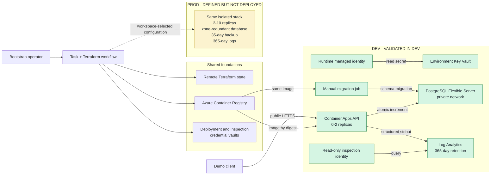

# Architecture Summary

## Situation and recommendation

NovaBank needs a low-risk first cloud step, not a lift-and-shift of its single
VM. The starting point must separate dev and prod, automate delivery, centralize
logs for at least 12 months, keep data in the EU, and create a credible path
toward 99.9% availability, RPO within one hour, and RTO within four hours.

The recommendation is an Azure platform built from managed services:

- Azure Container Apps runs a small containerized API without introducing a
  Kubernetes platform.
- Azure Database for PostgreSQL Flexible Server preserves the existing
  PostgreSQL model while removing VM-level database operations.
- One isolated Log Analytics workspace per environment retains application and
  Container Apps platform logs for 365 days.
- Terraform defines shared foundations plus separate dev and prod stacks. A
  small Task workflow builds an immutable image, runs an explicit migration,
  deploys dev, and proves one request from HTTPS through persistence to its
  correlated central log.

This is a production-shaped starting direction, not a production-ready bank
platform. Dev is deployed and validated; prod is reviewable code only. The
approach follows the staged, outcome-led intent of the
[CloudNation 6D Model](https://www.cloudnation.nl/en/inspiration/blogs/moving-to-the-cloud-how-to-structure-a-successful-migration)
without attempting to reproduce the full model in this assessment.

## Architecture

The database has no public network path. The API and migration job use a
managed identity to pull the image and read the database URL from Key Vault.
Database authentication itself still uses a generated password; moving that
connection to Microsoft Entra authentication is a production hardening step.

## Decisions and trade-offs

| Decision | Why it fits the first step | Accepted trade-off |
|---|---|---|
| Container Apps instead of AKS or a VM | Managed HTTPS, scaling, and container portability with little platform overhead | Public ingress is suitable for the demo but needs authentication and edge controls before production |
| PostgreSQL Flexible Server | Keeps PostgreSQL compatibility while Azure manages patching, backups, and optional zone redundancy | The dev Burstable tier is cost-conscious but does not prove production performance or recovery |
| Resource-group and logging isolation per environment | Limits blast radius and gives dev and prod separate data and query boundaries | A shared registry is a deliberate cost and simplicity choice |
| Terraform workspaces with committed YAML | One reviewable stack defines both environments without duplicating resources | Workspace isolation alone is not the final enterprise state or access model |
| Local Task workflow | Gives the assessment one repeatable operator path without temporary CI credentials | No approvals, artifact promotion, or workload federation are implemented |
| 365-day Log Analytics retention | Meets the stated duration in the proposed design and supports request correlation | Retention is not immutable audit archiving, and PostgreSQL diagnostic logs are not yet collected |

Design assumptions are owned by
[`docs/assumptions.md`](assumptions.md). The largest cost drivers are the
always-on PostgreSQL server and log ingestion/retention; dev therefore uses a
small database, scale-to-zero API, and a 1 GB daily log cap. Production sizing
and cost must be based on measured load and retention volume.

## Evidence and limitations

| Claim | Status | Evidence |
|---|---|---|
| A dev request persists an environment-scoped count and produces a correlated central log | **validated in dev** | [Observed request and log result](../demo/README.md#prove) |
| Deployment uses a digest-pinned image and completes the migration before enabling the API | **validated in dev** | [Observed deployment](../demo/README.md#deploy) and [workflow](../scripts/workflow.sh) |
| Dev infrastructure, scoped identities, private PostgreSQL connectivity, and 365-day logging can be provisioned from Terraform | **validated in dev** | [Infrastructure boundary](../iac/README.md) and [demo runbook](../demo/README.md) |
| Prod uses an isolated stack with two minimum API replicas, zone-redundant PostgreSQL, 35-day backups, and 365-day logs | **defined but not deployed** | [`prod.yaml`](../iac/application/prod.yaml) and [application stack](../iac/application/README.md) |
| The production design meets 99.9% availability, RPO within one hour, and RTO within four hours | **recommended next** | Requires production deployment, failure testing, backup restoration, monitoring, and operational ownership |
| Delivery has controlled promotion, approvals, workload identity, and production security controls | **recommended next** | [Prioritized hardening backlog](#risks-and-next-steps) |

The exact deployed proof, failed checks, and deliberately untested paths are
recorded in the [demo runbook](../demo/README.md). This assessment does not
claim production readiness.

## Risks and next steps

| Priority | Risk | Next step |
|---|---|---|
| First | Long-lived deployment secrets and a database password remain in Key Vault and encrypted Terraform state | Add workload identity federation, Microsoft Entra database authentication, PIM, and tighter roles ([#14](https://github.com/Lorenzvanijperen/cn-recruitment-assessment/issues/14)) |
| First | The API is anonymous and internet-facing; vault and state public endpoints support the local workflow | Add API authentication, edge protection, controlled egress, and proportionate private endpoints ([#13](https://github.com/Lorenzvanijperen/cn-recruitment-assessment/issues/13)) |
| First | Prod, failover, backup restore, RPO, and RTO are untested | Deploy through an approved production path and run resilience and recovery tests ([#20](https://github.com/Lorenzvanijperen/cn-recruitment-assessment/issues/20)) |
| First | Local delivery lacks separation of duties, approvals, and artifact promotion | Build Azure DevOps CI/CD with federated identities and environment checks ([#19](https://github.com/Lorenzvanijperen/cn-recruitment-assessment/issues/19)) |
| Then | Current telemetry is sufficient for the request trace, not regulated operations | Add database diagnostics, traces, alerts, dashboards, security monitoring, and controlled audit access ([#15](https://github.com/Lorenzvanijperen/cn-recruitment-assessment/issues/15)) |
| Then | Governance, maintainability, and cost controls are intentionally thin | Add policy, locks, stronger state isolation, focused Terraform modules, budgets, alerts, and rightsizing reviews ([#17](https://github.com/Lorenzvanijperen/cn-recruitment-assessment/issues/17), [#18](https://github.com/Lorenzvanijperen/cn-recruitment-assessment/issues/18), [#16](https://github.com/Lorenzvanijperen/cn-recruitment-assessment/issues/16)) |
